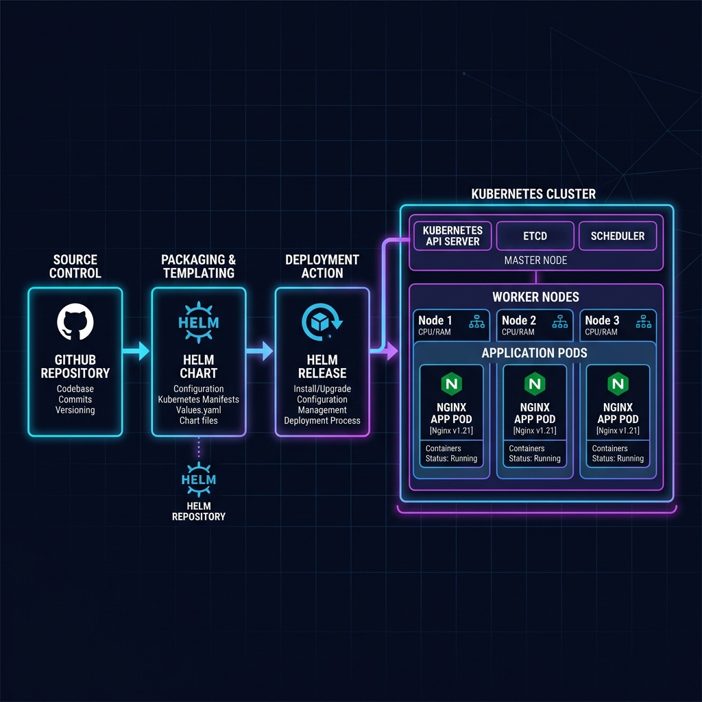
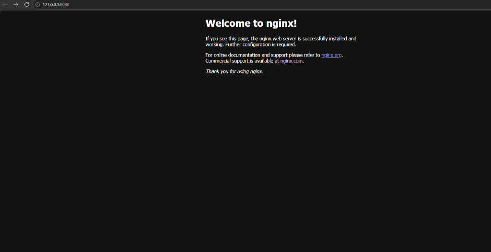

# Helm Chart Engineering for Kubernetes Application Deployment

A production-ready hands-on DevOps project demonstrating how to package, configure, deploy, upgrade, rollback, package, and debug a Kubernetes application using Helm.

## Architecture

Below is the workflow showing the journey from source code control to deployment in a Kubernetes Cluster:



```
GitHub (Source) ──> Helm Chart (Template) ──> Helm Release (Deployment) ──> Kubernetes Cluster ──> Nginx Pods
```

---

## 1. Project Directory Structure

The structure of the `helm-chart-demo/` project is as follows:

```text
helm-chart-demo/
├── Chart.yaml              # Chart metadata (API version, name, version, etc.)
├── values.yaml             # Default configuration values
├── values-dev.yaml         # Development environment overrides
├── values-prod.yaml        # Production environment overrides
├── .gitignore              # Excludes package archives and local credentials
├── README.md               # Project documentation
├── screenshots/
│   └── architecture.png    # High-level architecture diagram
└── templates/              # Kubernetes resource templates
    ├── _helpers.tpl        # Template helpers for naming & labels
    ├── deployment.yaml     # Application deployment template
    ├── service.yaml        # Service definition template
    ├── ingress.yaml        # Ingress configuration template
    ├── serviceaccount.yaml # ServiceAccount definition template
    └── NOTES.txt           # Post-installation notes displayed in terminal
```

---

## 2. Chart Metadata (`Chart.yaml`)

The `Chart.yaml` is the entry point of the Helm chart and defines the package metadata.

```yaml
apiVersion: v2
name: nginx-chart
description: A production-style Helm Chart that packages Nginx into reusable templates with configurable values.
type: application
version: 1.0.0
appVersion: "1.25.3"
```

### Metadata Fields Explained
* **`apiVersion`**: Defines the schema version of the Chart. `v2` is standard for Helm 3/4.
* **`name`**: The name of the chart.
* **`description`**: A human-readable description of the chart.
* **`type`**: The type of chart. `application` (deploys resources) or `library` (reusable utilities).
* **`version`**: The Semantic Version (SemVer) of the Helm Chart itself (`1.0.0`). This should be bumped whenever the chart templates change.
* **`appVersion`**: The version of the underlying application package (`1.25.3` for Nginx). This is pinned to a specific container tag.

---

## 3. Parameterization & Configurations

### Default Configurations (`values.yaml`)
Provides standard settings used when no environment-specific override is supplied.

```yaml
replicaCount: 2

image:
  repository: nginx
  pullPolicy: IfNotPresent
  tag: "" # Defaults to .Chart.AppVersion ("1.25.3") if empty

serviceAccount:
  create: true
  automount: true
  annotations: {}
  name: ""

podAnnotations: {}
podLabels: {}
podSecurityContext: {}
securityContext: {}

service:
  type: ClusterIP
  port: 80

ingress:
  enabled: false
  className: ""
  annotations: {}
  hosts:
    - host: chart-example.local
      paths:
        - path: /
          pathType: ImplementationSpecific
  tls: []

resources:
  limits:
    cpu: 200m
    memory: 256Mi
  requests:
    cpu: 100m
    memory: 128Mi

livenessProbe:
  httpGet:
    path: /
    port: http
readinessProbe:
  httpGet:
    path: /
    port: http

autoscaling:
  enabled: false

nodeSelector: {}
tolerations: []
affinity: {}
```

### Environment-Specific Configs

To support multi-environment deployments, we separate settings into dedicated values files:

#### Development Overrides (`values-dev.yaml`)
Optimized for resource conservation:
```yaml
# Development Environment Overrides
replicaCount: 1

service:
  type: ClusterIP
  port: 80

resources:
  limits:
    cpu: 100m
    memory: 128Mi
  requests:
    cpu: 50m
    memory: 64Mi
```

#### Production Overrides (`values-prod.yaml`)
Optimized for high-availability and scale:
```yaml
# Production Environment Overrides
replicaCount: 4

service:
  type: NodePort
  port: 80

resources:
  limits:
    cpu: 500m
    memory: 512Mi
  requests:
    cpu: 250m
    memory: 256Mi
```

---

## 4. Key Templates

### Deployment Manifest (`templates/deployment.yaml`)
Uses template syntax `{{ .Values.* }}` to render resources dynamically:

```yaml
apiVersion: apps/v1
kind: Deployment
metadata:
  name: {{ include "nginx-chart.fullname" . }}
  labels:
    {{- include "nginx-chart.labels" . | nindent 4 }}
spec:
  {{- if not .Values.autoscaling.enabled }}
  replicas: {{ .Values.replicaCount }}
  {{- end }}
  selector:
    matchLabels:
      {{- include "nginx-chart.selectorLabels" . | nindent 6 }}
  template:
    metadata:
      {{- with .Values.podAnnotations }}
      annotations:
        {{- toYaml . | nindent 8 }}
      {{- end }}
      labels:
        {{- include "nginx-chart.labels" . | nindent 8 }}
        {{- with .Values.podLabels }}
        {{- toYaml . | nindent 8 }}
        {{- end }}
    spec:
      {{- with .Values.imagePullSecrets }}
      imagePullSecrets:
        {{- toYaml . | nindent 8 }}
      {{- end }}
      serviceAccountName: {{ include "nginx-chart.serviceAccountName" . }}
      {{- with .Values.podSecurityContext }}
      securityContext:
        {{- toYaml . | nindent 8 }}
      {{- end }}
      containers:
        - name: {{ .Chart.Name }}
          {{- with .Values.securityContext }}
          securityContext:
            {{- toYaml . | nindent 12 }}
          {{- end }}
          image: "{{ .Values.image.repository }}:{{ .Values.image.tag | default .Chart.AppVersion }}"
          imagePullPolicy: {{ .Values.image.pullPolicy }}
          ports:
            - name: http
              containerPort: {{ .Values.service.port }}
              protocol: TCP
          {{- with .Values.livenessProbe }}
          livenessProbe:
            {{- toYaml . | nindent 12 }}
          {{- end }}
          {{- with .Values.readinessProbe }}
          readinessProbe:
            {{- toYaml . | nindent 12 }}
          {{- end }}
          {{- with .Values.resources }}
          resources:
            {{- toYaml . | nindent 12 }}
          {{- end }}
```

### Service Manifest (`templates/service.yaml`)
```yaml
apiVersion: v1
kind: Service
metadata:
  name: {{ include "nginx-chart.fullname" . }}
  labels:
    {{- include "nginx-chart.labels" . | nindent 4 }}
spec:
  type: {{ .Values.service.type }}
  ports:
    - port: {{ .Values.service.port }}
      targetPort: http
      protocol: TCP
      name: http
  selector:
    {{- include "nginx-chart.selectorLabels" . | nindent 4 }}
```

---

## 5. Deployment & Release Lifecycle Walkthrough

### Step 1: Verification & Linting
Validate the structure and YAML syntax before deploying:
```bash
helm lint .
```
**Output:**
```text
==> Linting .
[INFO] Chart.yaml: icon is recommended

1 chart(s) linted, 0 chart(s) failed
```

Dry-run rendering of local templates:
```bash
helm template .
```

### Step 2: Install Release
Deploy the Nginx chart with default configuration (2 replicas):
```bash
helm install nginx-app .
```
**Output:**
```text
NAME: nginx-app
LAST DEPLOYED: Thu Jun 25 15:42:03 2026
NAMESPACE: default
STATUS: deployed
REVISION: 1
```

Verify the running resources:
```bash
kubectl get pods
```
**Output:**
```text
NAME                                     READY   STATUS    RESTARTS   AGE
nginx-app-nginx-chart-54bd478bd4-fztq6   1/1     Running   0          47s
nginx-app-nginx-chart-54bd478bd4-gsxcb   1/1     Running   0          47s
```

Access the application via port-forwarding:
```bash
kubectl port-forward svc/nginx-app-nginx-chart 8080:80
```

Verify in your browser at `http://127.0.0.1:8080`:



### Step 3: Upgrade Flow (Scaling up to 4 replicas)
Modify `replicaCount` to `4` in `values.yaml` and execute the upgrade command:
```bash
helm upgrade nginx-app .
```
**Output:**
```text
Release "nginx-app" has been upgraded. Happy Helming!
NAME: nginx-app
REVISION: 2
STATUS: deployed
```

Verify that the deployment has scaled up to 4 pods:
```bash
kubectl get deployment
```
**Output:**
```text
NAME                    READY   UP-TO-DATE   AVAILABLE   AGE
nginx-app-nginx-chart   4/4     4            4           78s
```

### Step 4: Rollback Flow
List the revision history of the release:
```bash
helm history nginx-app
```
**Output:**
```text
REVISION	UPDATED                 	STATUS    	CHART            	APP VERSION	DESCRIPTION     
1       	Thu Jun 25 15:42:03 2026	superseded	nginx-chart-1.0.0	1.25.3     	Install complete
2       	Thu Jun 25 15:43:12 2026	superseded	nginx-chart-1.0.0	1.25.3     	Upgrade complete
```

Rollback to revision 1 (scaling back down to 2 replicas):
```bash
helm rollback nginx-app 1
```
**Output:**
```text
Rollback was a success! Happy Helming!
```

Verify that the pods scaled back down to 2:
```bash
kubectl get deployment
```
**Output:**
```text
NAME                    READY   UP-TO-DATE   AVAILABLE   AGE
nginx-app-nginx-chart   2/2     2            2           3m9s
```

---

## 6. Packaging & Versioning

### Packaging
Package the Helm chart folder into a deployable gzip archive (`.tgz`):
```bash
helm package .
```
**Output:**
```text
Successfully packaged chart and saved it to: C:\Users\AR VR 24\Desktop\Helm_Chart_Engineering\helm-chart-demo\nginx-chart-1.0.0.tgz
```

### Versioning Guidelines
Helm relies heavily on **Semantic Versioning (SemVer)** (e.g., `MAJOR.MINOR.PATCH`):
1. **MAJOR version** (`1.0.0` -> `2.0.0`): Breaking changes, incompatible API updates or major removals in templates.
2. **MINOR version** (`1.0.0` -> `1.1.0`): Additive changes, introducing new variables in `values.yaml` or backward-compatible features in manifests.
3. **PATCH version** (`1.0.0` -> `1.0.1`): Backward-compatible bug fixes or minor structural corrections.

### Release Lifecycle
A **Release** is a running instance of a chart combined with a specific configuration (`values.yaml`). Every time a command (`install`, `upgrade`, `rollback`) is executed, Helm increments the release **Revision** and stores metadata in Kubernetes Secrets (default) or ConfigMaps. This enables tracking changes and performing instantaneous rollbacks.

---

## 7. Debugging & Troubleshooting

### Local Rendering / Dry Runs
Generate and output template YAML locally without connecting to a cluster:
```bash
helm template .
```

To perform validation checks against the cluster APIs without executing the install:
```bash
helm install nginx-app . --dry-run --debug
```

### Common Troubleshooting Scenarios

#### Scenario A: Invalid Template Syntax
* **Symptoms**: Running `helm install` or `helm template` returns errors like:
  ```text
  Error: parse error at (nginx-chart/templates/deployment.yaml:8): bad character U+007B '{'
  ```
* **Resolution**:
  1. Inspect the referenced file and line number.
  2. Ensure Go template tags are formatted correctly with proper spacing (`{{ .Values.replicaCount }}`).
  3. Validate that indentation uses spaces (not tabs) using `nindent <N>` or `indent <N>`.

#### Scenario B: Values Mismatch / Empty Fields
* **Symptoms**: Values render empty (e.g., `image: "nginx:"` with a missing tag).
* **Resolution**:
  1. Execute `helm template .` and verify the output container images/configs.
  2. Ensure the variable path exists in `values.yaml`. For example, accessing `{{ .Values.img.tag }}` when the key is structured as `image.tag` will result in `<nil>`.
  3. Use the `default` template function to guard critical keys: `{{ .Values.image.tag | default "latest" }}`.

#### Scenario C: Image Pull Failure
* **Symptoms**: Pods remain in `ImagePullBackOff` or `ErrImagePull` status.
* **Resolution**:
  1. Retrieve pod information and examine events:
     ```bash
     kubectl describe pod <pod-name>
     ```
  2. Look at the bottom `Events` section:
     ```text
     Warning  Failed     10s (x3 over 45s)  kubelet            Failed to pull image "nginx:invalid-tag": RPC error: code = Unknown desc = failed to pull and unpack image
     ```
  3. Correct the image repository or tag spelling in `values.yaml` and run `helm upgrade`.

---

## 8. Security Best Practices

1. **Environment Separation**: Always keep dev, staging, and prod variables in independent files (`values-dev.yaml`, `values-prod.yaml`) and pass them using `-f`:
   ```bash
   helm install nginx-app -f values-prod.yaml .
   ```
2. **Never Commit Secrets**: Add directories containing database passwords or tokens to `.gitignore` (such as `*.secret.yaml`, `secrets/`).
3. **Use External Secrets Operators**: Instead of plain text secrets inside Helm templates, reference `ExternalSecret` custom resources that pull credentials dynamically from secure vaults (e.g. AWS Secrets Manager, HashiCorp Vault).
4. **Pin Container Image Versions**: Avoid using `latest` or mutable tags. Pin image tags (e.g. `1.25.3`) in `values.yaml` to ensure deployments are predictable and reproducible.
